```{r setup, include=FALSE}
options(htmltools.dir.version = FALSE)
```


## Outline

- Overall theme of dissertation
- What’s already completed
  - Multimorbidity Explorer
  - SBM for ME
- SBM
  - Intuition
  - How the hSBM is fit
  - Posterior
  - Sampling
  - MAP vs Sampling
- Next steps forward
  - First paper
  - Next two papers
    - Formalizing SBM
- Journals and conferences to target
- Timeline
- Expectations

---
class: middle

# Overall theme of dissertation

> Methods and tools for exploration and explanation of *omics data.

- Currently focused on phenome
- Emphasis on the real-world deployment of methods via visualization heavy applications

---

class: middle

# What’s already completed

- Draft of first paper (Multimorbidity Explorer)
- SBM on Myloid disease and heart failure

---
## Multimorbidity Explorer

- Application for investigating PheWAS results
- Dig into individual-level data and patterns of morbidity
- Presented to PheWAS group, RStudio internal meeting, and invited to RStudio:conf 2019

<div style="text-align:center;">
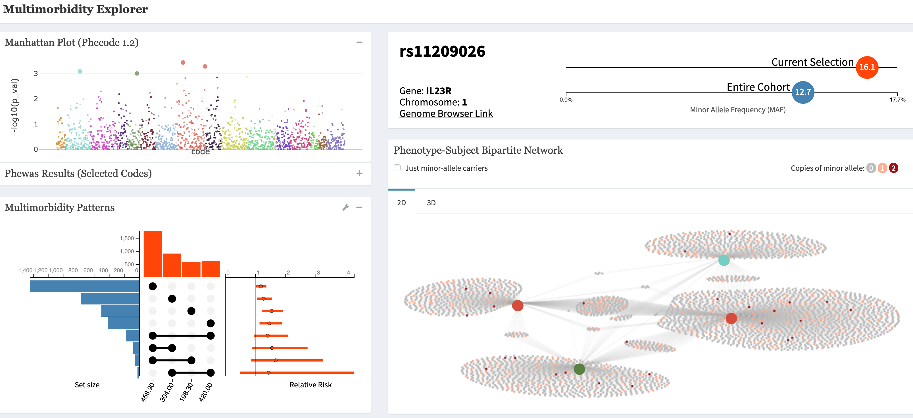 
</div>


---
class: middle, center

### [ME Poster](http://nickstrayer.me/rstudioconf19_me-poster/)

---
## SBM on MDS/HF

- Applied SBM (more info soon) to cluster patients and phecodes and then looked at how disease of interest related
- Simplified result for MDS are being written up in manuscript now with Michael Savona's lab (co-first author)
- Results 'make sense' to collaborators

<div style="text-align:center;">
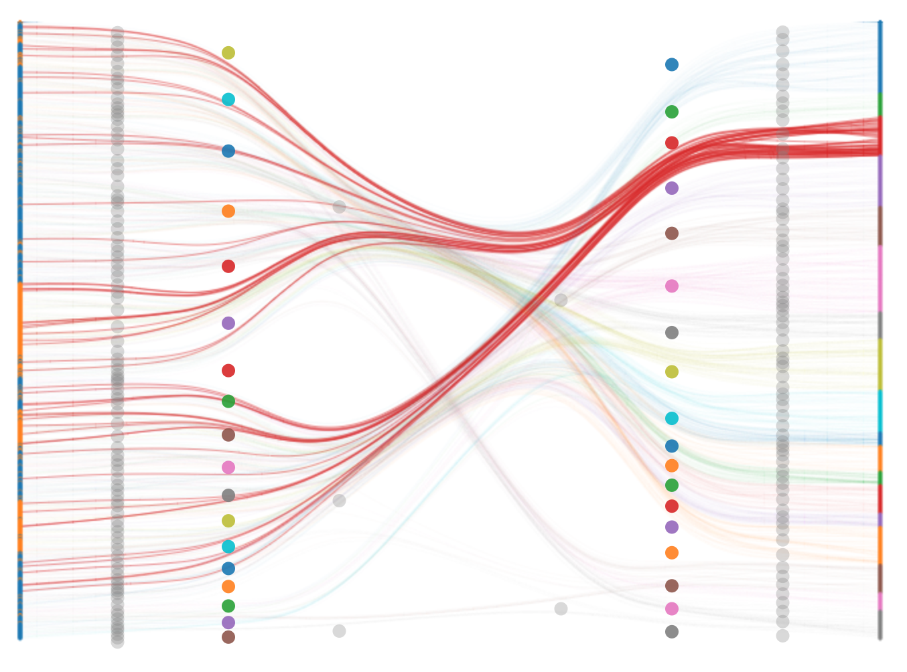 
.caption[SBM Results on MDS data]
</div>

---

### Demos


[Dendrogram](https://prod.tbilab.org/mds_structure/visualizing_mds_clusters.html)

<hr>

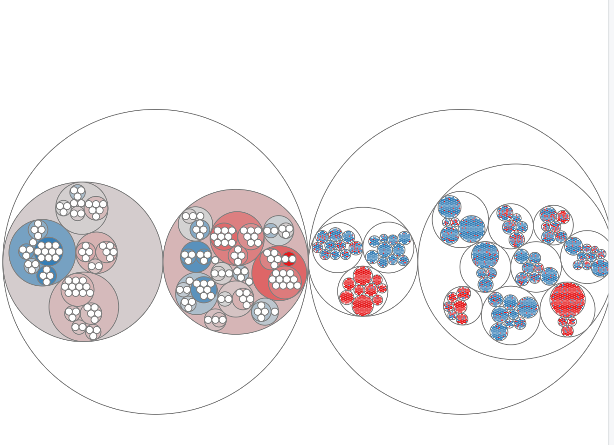
---
# The SBM
- __S__tochastic __B__lock __M__odel. 
  - Bayesian non-parametric method for learning network structure. 
  - Clusters nodes into groups that have similar edge patterns.
- Developed in social network research. 
  - 'How can we group users of platform X into cliques?'
- [Bayesian stochastic blockmodeling, Peixoto 2018](https://arxiv.org/abs/1705.10225) great intro from basics
  
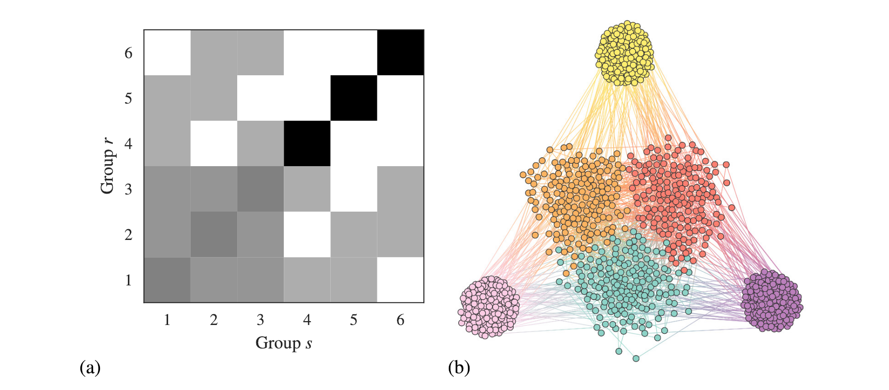

---
## Hierarchichal SBM (hSBM)

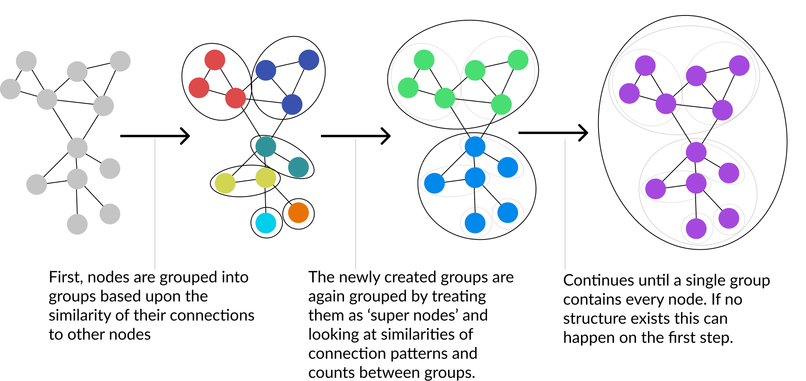

- [Hierarchical Block Structures and High-Resolution Model Selection in Large Networks, Peixoto 2014](https://arxiv.org/abs/1310.4377)
  - Good intro but covered in book chapter above just as well

---
## Bipartite SBM


<div style="text-align:center;">
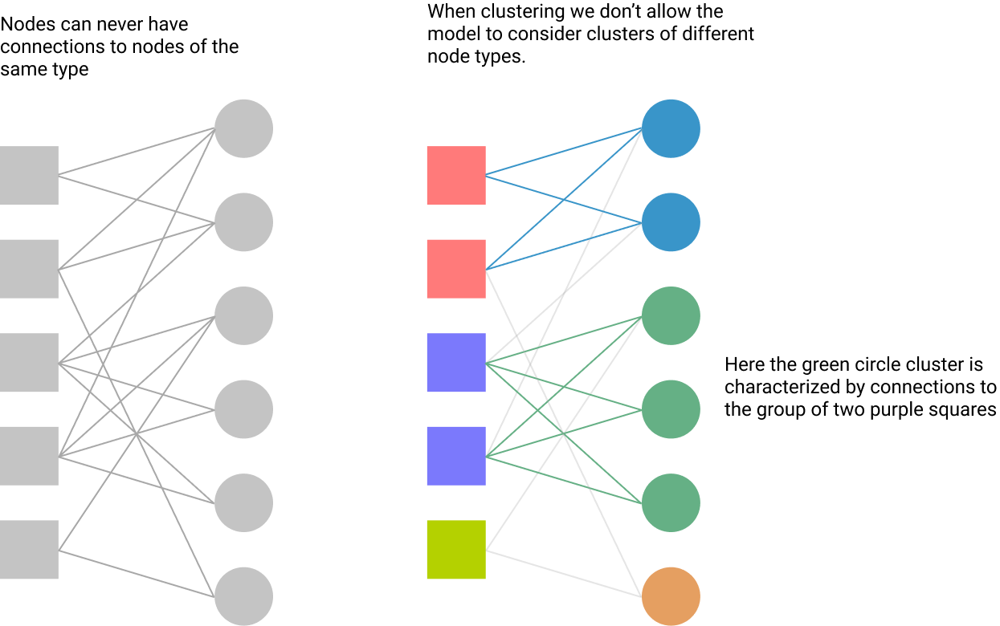  </br>
.caption[SBM Results on MDS data]
</div>

- Started with [Efficiently inferring community structure in bipartite networks, Jacobs et al 2014](https://arxiv.org/pdf/1403.2933.pdf)
- Expanded to hierarchichal in [A network approach to topic models, Altmann et al 2018](http://advances.sciencemag.org/content/4/7/eaaq1360)

---
## Posterior

<div style="text-align:center;">
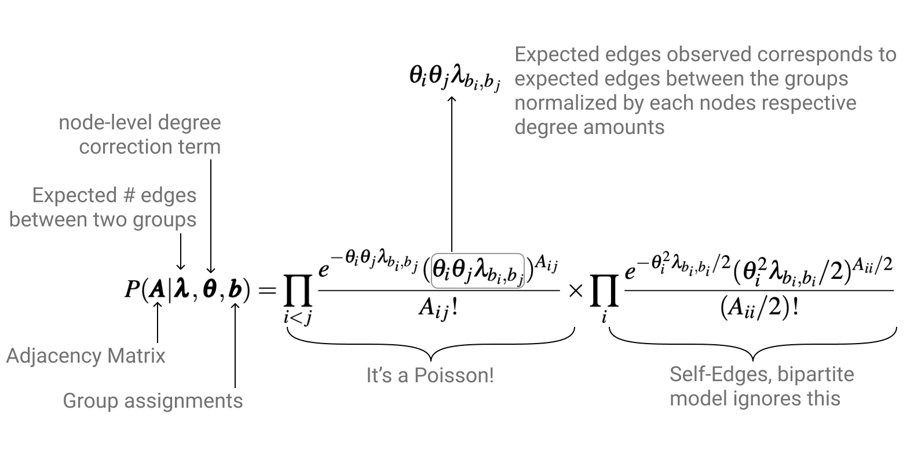  </br>
</div>


---
## Sampling

- Very similar to algorithm for MCMC on Dirichlete processes
- Sampling from the posterior involves scanning through each node and deciding to switch group membership or not

<div style="text-align:center;">
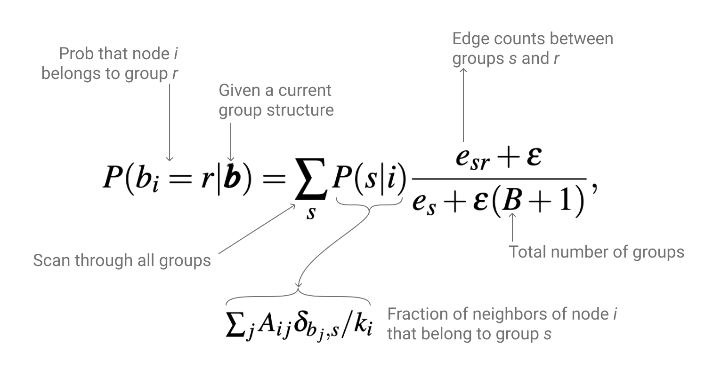  </br>
</div>

---

## MAP vs Sampling

- Almost all usages of the model use the MAP form of the model
- Sampling _is_ talked about but not a lot
- I think this is due to lack of ability to easily display stability/ interpret results


<div style="text-align:center;">
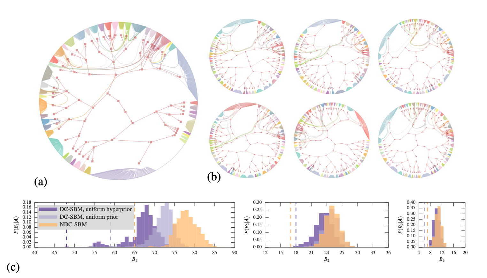  </br>
.caption[Figure 14 from Peixoto 2018]
</div>

---

class: center, middle

# Next steps forward

---

## Submit first paper

- Finish editing draft with positive use-cases
- Decide destination (Bioinformatics vs IEEEviz)
- Timeframe: _soon_


<div style="text-align:center;">
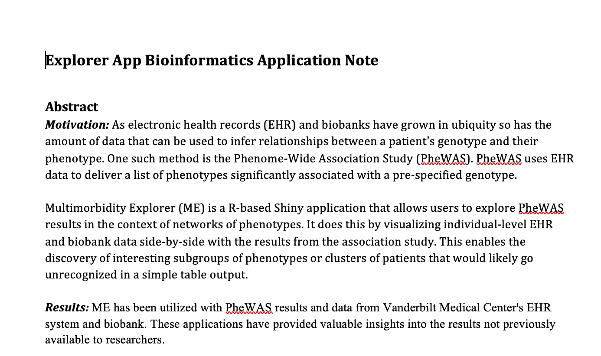
</div>

---
class: middle
## Next two papers

- Need to settle on a path
- Method options include:
  - Methods for assessing stability of posterior
  - Formalize semi-supervized method for finding clusters associated with a given status (SNP, disease, etc)
- Application options: 
  - Leaning towards application for HF data

---

### Methods for assessing stability of posterior

- How do we visualize a discrete and changing-dimension posterior? 
- Stability indicated by a smaller proportion of branching
  - Could probably be formalized into a number as well

<div style="text-align:center;">
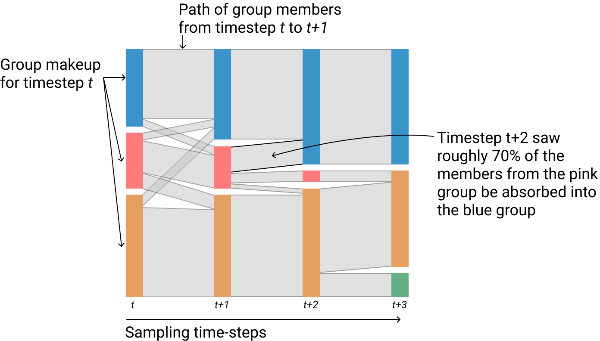
</div>


---

### Formalize semi-supervized method

.pull-left[
- Force the model to seperate cases and controls just like we did with node-types
- Hierarchichal nature allows investigation of subpatterns in cases (or controls)
- Could entirely replace single-variate methods like traditional PheWAS
]

.pull-right[
<div style="text-align:center;">
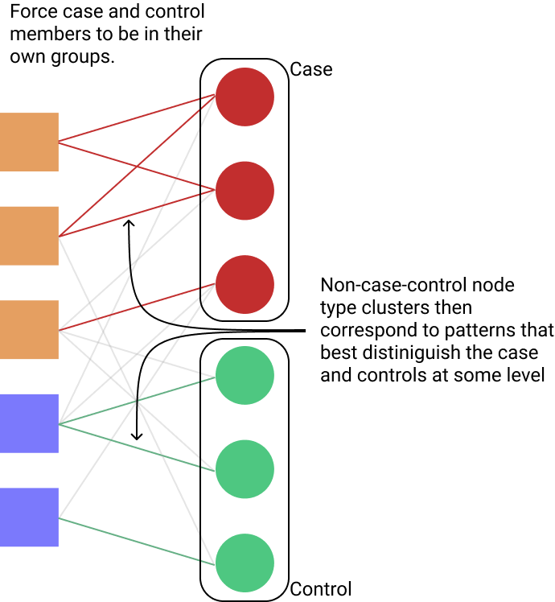
</div>
]


---
# Journals and conferences to target

.pull-left[
### IEEEviz
- Visualization focused conference
- VAST

### Bioinformatics 
- Application notes for applications
- Methods...
]

.pull-right[
### Networks Journals/Conferences
- Relatively unfamiliar
- NetSci conference
- Lots publish in Science Communications, Nature Methods, etc
]

---

# Timeline


<iframe style="border: none;" width="800" height="450" src="https://www.figma.com/embed?embed_host=share&url=https%3A%2F%2Fwww.figma.com%2Ffile%2FJiH8J0mlqRkjGYtzAtECGSnm%2FDissertation-Diagrams%3Fnode-id%3D8%253A20" allowfullscreen></iframe>

---
class: middle
# Expectations

What do I need to get done in order to graduate when desired?

[Google Doc](https://docs.google.com/document/d/1lSLqWWYaeJUi1jJZy44hY9OIu2JrQ_c77DrZDcry-UU/edit)