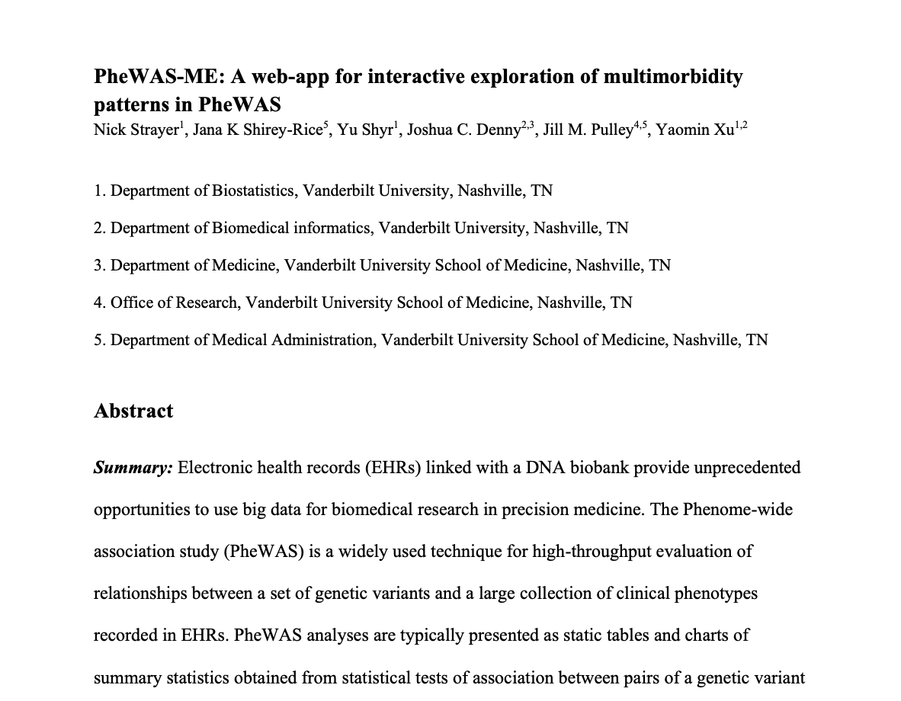
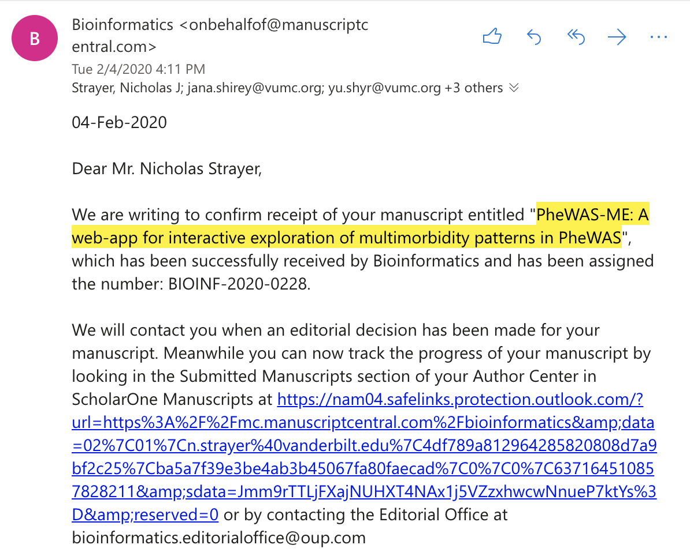
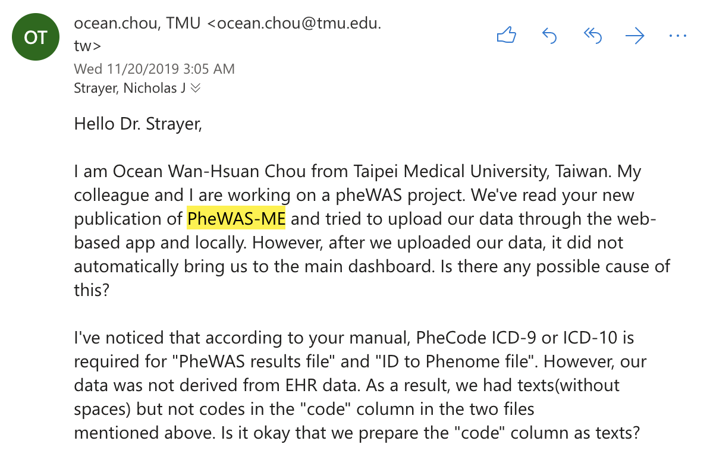
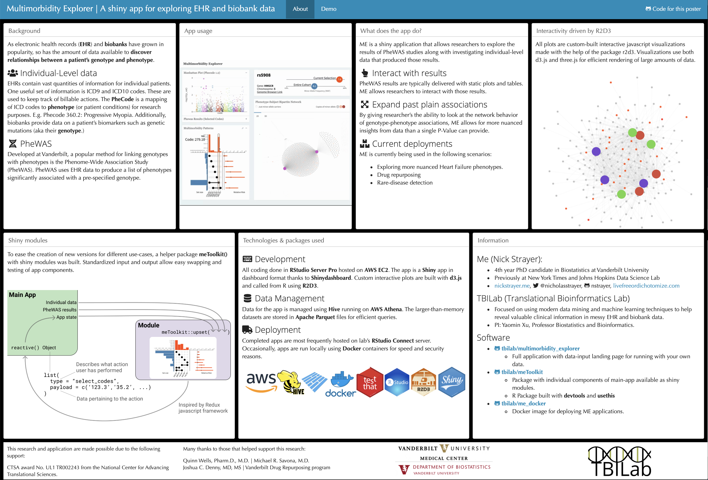
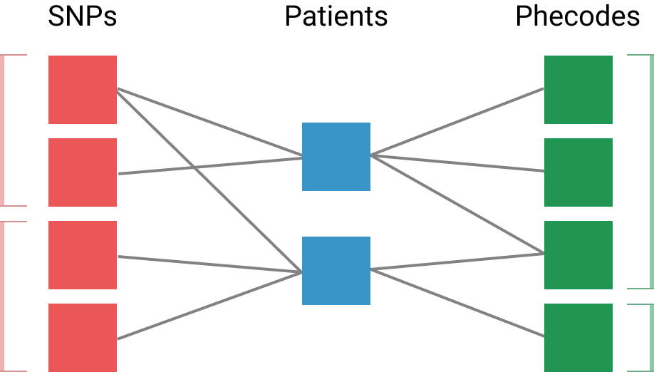
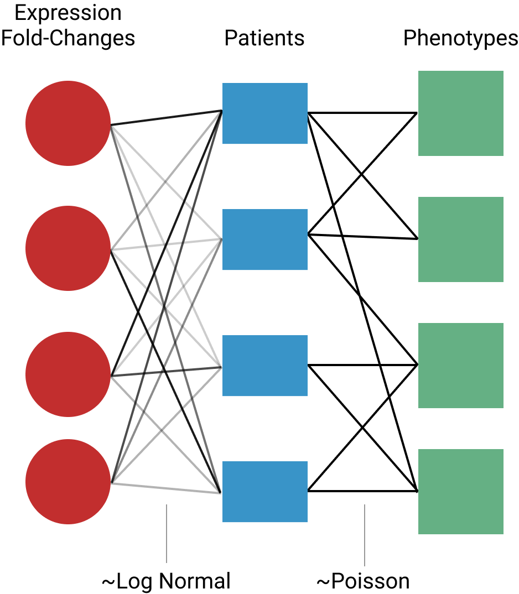
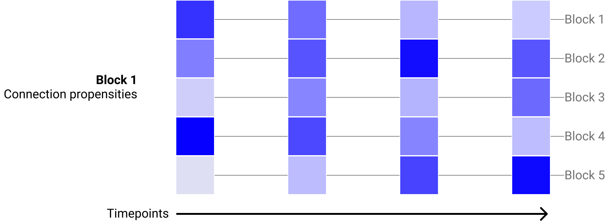
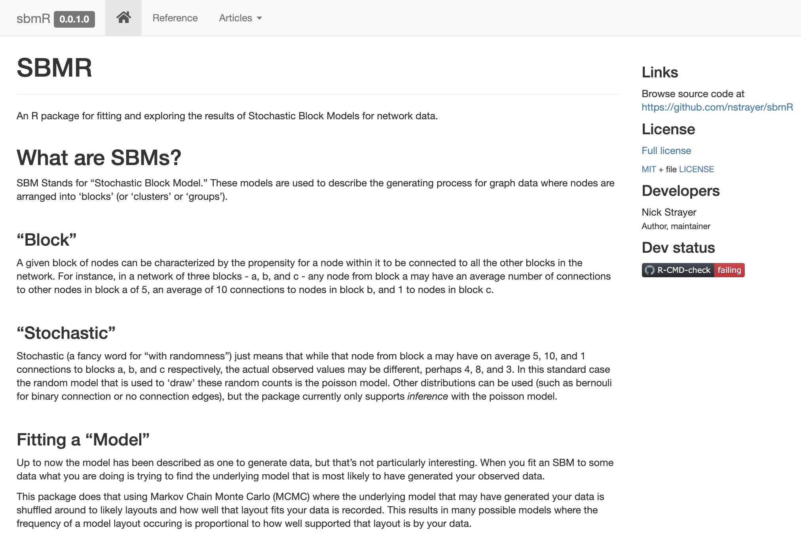
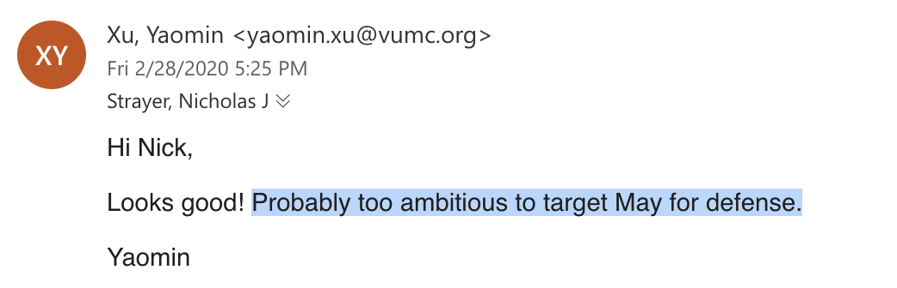

```{r setup, include=FALSE}
options(htmltools.dir.version = FALSE)
```

# Slides Layout

![:space 4]

.side-bullet.big-left.middle[

Final paper plan

- First paper
- Second paper
- Third Paper

]


![:space 4]

.side-bullet.big-left.middle[

After graduation plans


]

![:space 4]


.side-bullet.big-left.middle[

Timeline


- The goal
- Potential challenges
- Why this timeline
 
]

---
class: four-square

# Paper \#1: Phewas ME (Submitted to Bioinformatics)









---

# Paper \#2: Consensus SBM: An uncertainty-aware network clustering method


.side-bullet.big-left.topics[
SBMs

- Cluster network data
- Flexible in format ({bi, tri, ...}-partite networks)
- Interpretable
]


.side-bullet.big-left.topics.nopad[
### +
]

.side-bullet.big-left.topics[
### Consensus Clustering

- Recognizes that many clusterings may fit data
- Reduce data to pairwise "probability of being in same cluster" distances
]


.side-bullet.big-left.topics.nopad[
### =
]


.side-bullet.big-left.topics[
### C-SBM
- Use posterior to quickly sample lots of potential partitionings
- Consensus clustering provides window to view super high-dimensional results
]

---
class: middle, center

## Performance on simulated data

### [`sbmR` Vignette](http://nickstrayer.me/sbmR/articles/sampling_from_posterior.html)

---

## What does this contribute?


![:space 8]

.side-bullet[
__Statistically principled method of clustering data that defies common probability functions__


_What is the distribution of an entire genome or phenome?_
]

![:space 4]


.side-bullet[
__A new way of looking at the results of bayesian SBMs__

_Previous results either ignored or used summary stats_
]

![:space 4]
  
.side-bullet[
__An easy jumping off point for specialization into more specialized methods__

_Polypartite specialization, Time-dependent, ..._
]


---
class: center, middle

# How can it be expanded?

---

### Polypartite specialization

.side-bullet[
Place restrictions on potential connections

_Can greatly increase the models power to resolve structure_
]

.side-bullet.move-up[
`sbmR` package allows defining complex relationships between nodes

_I am not aware of any other software doing this_
]

![:space 4]



  
---
class: one-to-two

### Multiple edge types

.left-side[

![:space 18]

- What if the "network" has different edge types? 

![:space 5]

- E.g. ICD9 counts and protein fold changes

![:space 5]

- SBM fitting protocols could be modified to deal with this
]

.right-side[

]


---
  
### Time dependence
  
- How do comorbidities or protein pathways change over time?
- Clusters remain the same, edge propensities change. 
- See [Role Detection in Bicycle-Sharing Networks Using Multilayer Stochastic Block Models](https://arxiv.org/abs/1908.09440) by Carlen Et Al

![:space 5]


  

---
class: middle 

## Potential journals

- Nature Methods
- American Statistician
- Bioinformatics
- ...?


---


## Paper \# 3: sbmR: An R package for fast and robust fitting and investigation of SBM models in R.



---

## Effort report (by the numbers)

.side-bullet.big-left.middle[
1,100+

[Git commits](https://github.com/nstrayer/sbmR/commits/master)
]

.side-bullet.big-left.middle[
842

Unit tests ([171 R tests](https://github.com/nstrayer/sbmR/tree/master/tests/testthat), [671 C++ tests](https://github.com/nstrayer/sbmR/tree/master/src/cpp_tests))

]


.side-bullet.big-left.middle[
33

[Fully documented functions](http://nickstrayer.me/sbmR/reference/index.html)
]

.side-bullet.big-left.middle[
2

Invited conference presentations
]


.side-bullet.big-left.middle[
### 1

[Package website](http://nickstrayer.me/sbmR)
]


---

## Features beyond consensus SBMs

![:space 13]

.side-bullet.big-left.middle[
[New more efficient agglomerative merging technique](http://nickstrayer.me/sbmR/articles/agglomerative_merging.html)

- Cuts runtime of original algorithm down by roughly a factor of `N`
- Demos of superior performance in package vignettes
]

![:space 10]


.side-bullet.big-left.middle[
[Advanced node and edge type specification](http://nickstrayer.me/sbmR/reference/new_sbm_network.html#examples)

- No other package that I am aware of does this
- Enables semi-supervised approaches etc. 
]
  


---
class: middle

## Potential journals

- R Journal
- Bioinfomatics (application note)

---
class: four-square

# After graduation plans


### Hopkins Postdoc
### Hopkins Data Scientist
### LA Times Data Scientist
### Other places to consider?


---
class: middle

# Timeline


---
# Potential challenges

![:space 8]


![:space 5]

.pull-left[
- Slow reviews
- Long edits
]

.pull-right[
- Collaboration work
- Overambition
]


---
# Why this timeline

![:space 8]

.side-bullet.middle[
My Wife

- PhD Candidate in Biochemistry
- Targeting similar time
]

![:space 5]

.side-bullet.middle[
Job Market

- More openings in summer months
- I've been saying "May-ish" to companies
]

![:space 5]

.side-bullet.middle[
I've been here a while

- May marks end of 5th school-year
- People probably want rid of me
- Summers are really hot here
]
